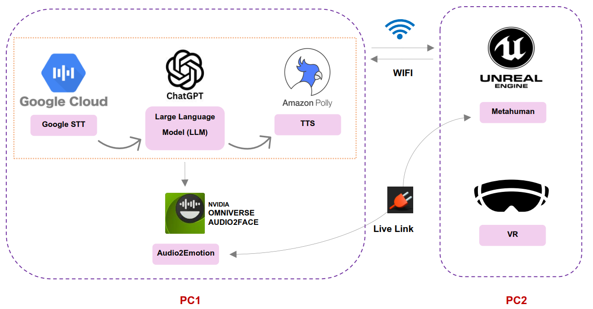

# Emotionally_Expressive_Child_Avatars

rchitecture for real-time emotionally expressive child avatars. PC1 processes speech input (Google Cloud
STT), generates a text response via a large language model (LLM), and synthesizes speech using Amazon Polly TTS.
The resulting audio is analyzed by NVIDIA Audio2Face to extract emotional parameters for facial animation. PC2
renders a customizable Metahuman avatar (Unreal Engine) driven by this emotional data in real time. Synchronization
is achieved using the Live Link plugin, and the system supports deployment in both desktop and VR environments.
