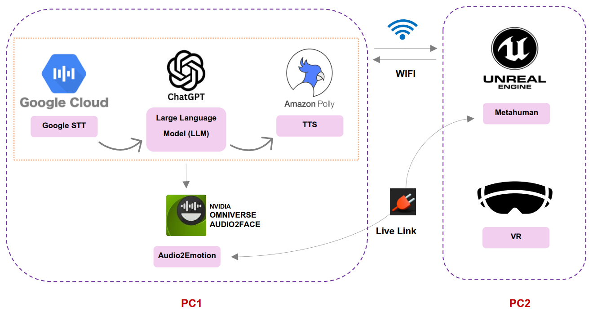

# Emotionally Expressive Child Avatars

[](https://journals.uio.no/NMI/article/view/12537)
[](https://arxiv.org/abs/2506.13477)

## Overview

>>>>>>> cb33ed2 (Update readme file)

This repository contains research prototype assets and notebooks for an emotionally expressive child-avatar pipeline for training applications. The notebooks demonstrate a voice-driven interaction loop: capture speech from a microphone, transcribe it, generate a text response, synthesize speech audio, and stream that audio into NVIDIA Audio2Face so an avatar can speak with facial animation.

The repository also includes architecture diagrams, USD avatar/stage assets, generated Audio2Face gRPC bindings, demo video links, and a questionnaire PDF used for avatar/video evaluation.

## Key Features

- Interactive Jupyter notebooks for an ASR -> language model -> TTS -> Audio2Face avatar workflow.
- Speech recognition through the `speech_recognition` package using `recognize_google`.
- Text generation examples using `revChatGPT` and the OpenAI Python package.
- TTS examples using `gTTS`; `omnivers-pegah.ipynb` also includes IBM Watson Text to Speech cells.
- Audio conversion helpers using `pydub`, `scipy.io.wavfile`, and NumPy.
- Audio2Face gRPC helper functions for pushing a complete audio track or streamed audio chunks.
- Generated protobuf bindings for the `nvidia.audio2face.Audio2Face` service.
- USD assets and thumbnails for avatar/Audio2Face scenes.
- Architecture and development pipeline diagrams.
- Demo video links for avatars expressing joy, sadness, and anger.

## System Architecture

The diagrams in `assets/` describe a two-machine avatar architecture:

- PC1 handles speech input, language-model response generation, speech synthesis, and Audio2Face emotion/facial-animation processing.
- PC2 renders a MetaHuman avatar in Unreal Engine, with synchronization through Live Link.
- The README and diagrams reference desktop and VR deployment targets, but this repository does not include deployment scripts for those targets.

The notebooks implement a local prototype flow:

1. A microphone records user speech through `speech_recognition`.
2. The recorded audio is transcribed with Google Web Speech via `recognize_google`.
3. The transcript is sent to a language-model function, either through `revChatGPT` or OpenAI completion calls.
4. The generated text is converted to speech with `gTTS` or, in selected cells, IBM Watson Text to Speech.
5. The audio is converted to mono WAV/float32 NumPy audio.
6. `audio2face_streaming_utils.py` sends the audio to Audio2Face over gRPC.
7. Audio2Face drives the avatar stage at `/World/audio2face/PlayerStreaming`, expected by the notebooks.

Architecture assets:




## Repository Structure

```text
.
|-- README.md
|-- LICENSE
|-- .env.example
|-- .gitignore
|-- avatar_requirements.yml
|-- audio2face_streaming_utils.py
|-- audio2face_pb2.py
|-- audio2face_pb2_grpc.py
|-- build-an-avatar-with-ASR-TTS-ChatGPTOmniverse-Audio2Face.ipynb
|-- omnivers-pegah.ipynb
|-- assets/
|   |-- arch.png
|   `-- dev-pipeline.png
|-- questionnaire/
|   `-- questionnaire.pdf
|-- USD_files/
|   |-- claire_audio_streaming.usd
|   `-- .thumbs/256x256/claire_audio_streaming.usd.png
|-- version2/
|   |-- Claire2.usd
|   `-- .thumbs/256x256/Claire2.usd.png
|-- New folder/
|   |-- ilma.usd
|   `-- .thumbs/256x256/ilma.usd.png
|-- .ipynb_checkpoints/
`-- __pycache__/
```

Important notes:

- `audio2face_pb2.py` and `audio2face_pb2_grpc.py` are generated files for the Audio2Face protobuf service.
- `USD_files/`, `version2/`, and `New folder/` contain binary USD assets. They are not renamed or reorganized here because external Omniverse, Unreal, or notebook references may depend on their current paths.
- `.ipynb_checkpoints/` and `__pycache__/` are tracked in the current repository history. The new `.gitignore` prevents new checkpoint/cache files from being added accidentally, but it does not remove already tracked files.

## Requirements

Confirmed from repository files:

- Conda or a compatible environment manager.
- Python environment described by `avatar_requirements.yml` (`name: avatar`, Python 3.9 in the environment file).
- Jupyter Notebook/JupyterLab, included in `avatar_requirements.yml`.
- NVIDIA Omniverse Audio2Face running in streaming mode.
- Audio2Face gRPC endpoint expected by the notebooks: `localhost:50051`.
- Audio2Face player prim expected by the notebooks: `/World/audio2face/PlayerStreaming`.
- A working microphone for the interactive notebook loop.
- Network access for services used by the notebooks, including Google Web Speech through `speech_recognition`, OpenAI/revChatGPT, `gTTS`, and IBM Watson Text to Speech if using the IBM cells.
- Unreal Engine, MetaHuman, and Live Link are referenced by the architecture documentation and diagrams for rendering the avatar, but exact Unreal project setup steps are not specified in this repository.

## Installation

Clone the repository:

```bash
git clone https://github.com/pegahsalehi/Emotionally_Expressive_Child_Avatars.git
cd Emotionally_Expressive_Child_Avatars
```

Create the Conda environment from the provided file:

```bash
conda env create -f avatar_requirements.yml
conda activate avatar
```

The repository does not include a separate `requirements.txt`, `pyproject.toml`, setup script, or automated install script.

## Configuration

Copy `.env.example` or set the same variables in your shell or notebook kernel. The notebooks do not currently load `.env` files automatically, so variables must be available to the running Python process.

Required or used variables:

| Variable | Used by | Notes |
| --- | --- | --- |
| `OPENAI_API_KEY` | OpenAI/revChatGPT notebook cells | The previous hardcoded notebook value has been removed. Use a local secret only. |
| `IBM_WATSON_TTS_APIKEY` | IBM Watson TTS cells in `omnivers-pegah.ipynb` | Required only for IBM Watson TTS cells. |
| `IBM_WATSON_TTS_URL` | IBM Watson TTS cells in `omnivers-pegah.ipynb` | Required only for IBM Watson TTS cells. |

Hardcoded runtime defaults still present in the notebooks:

| Setting | Value |
| --- | --- |
| Audio2Face host | `localhost` |
| Audio2Face gRPC port | `50051` |
| Audio2Face player prim | `/World/audio2face/PlayerStreaming` |
| Audio sample rate | `22050` |

Do not commit real API keys, access tokens, cloud credentials, or local `.env` files.

## Usage

No standalone command-line entry point is specified in the repository. The main workflows are interactive notebooks.

1. Start NVIDIA Omniverse Audio2Face.
2. Open the relevant USD stage in Audio2Face and enable streaming mode.
3. Confirm that the streaming player prim matches `/World/audio2face/PlayerStreaming`, or update the notebook variable `a2f_avatar_instance`.
4. Confirm the gRPC endpoint is reachable at `localhost:50051`, or update `default_url` and `default_port` in the notebook.
5. Set the required environment variables for the notebook cells you plan to run.
6. Open one of the notebooks and run the cells interactively:
   - `build-an-avatar-with-ASR-TTS-ChatGPTOmniverse-Audio2Face.ipynb`
   - `omnivers-pegah.ipynb`

`audio2face_streaming_utils.py` is imported by the notebooks. It does not define a CLI, but it exposes:

- `push_audio_track(url, audio_data, samplerate, instance_name)`
- `push_audio_track_stream(url, audio_data, samplerate, instance_name)`

## Running the Full Pipeline

The expected end-to-end workflow is:

1. User speaks into the microphone.
2. `speech_recognition.Recognizer` records the audio.
3. `recognize_google(audio, language="en-US")` converts speech to text.
4. The transcript is sent to a language-model function.
5. The response text is synthesized into speech audio.
6. The audio is converted to mono WAV/float32 NumPy data.
7. `push_audio_track` sends the audio to Audio2Face over gRPC.
8. Audio2Face plays the audio and drives facial animation for the configured avatar instance.
9. Unreal Engine/MetaHuman rendering through Live Link is part of the documented architecture, but the repository does not include complete Unreal project setup instructions.

## Examples / Demo

Included repository examples:

- `assets/dev-pipeline.png`: development pipeline diagram.
- `assets/arch.png`: system architecture diagram.
- `questionnaire/questionnaire.pdf`: two-page questionnaire/evaluation document.
- USD assets:
  - `USD_files/claire_audio_streaming.usd`
  - `version2/Claire2.usd`
  - `New folder/ilma.usd`

Demo videos linked from the original README:

| Emotion | Link |
| --- | --- |
| Sad | [Video 1](https://youtu.be/c1kzG0QLAeQ) |
| Joy | [Video 2](https://youtu.be/rLX_293HqQA) |
| Angry | [Video 3](https://youtu.be/yDPRW7z9vgA) |
| Sad | [Video 4](https://youtu.be/m37s2LGMxEY) |
| Joy | [Video 5](https://youtu.be/jgnOVcH5GnE) |
| Angry | [Video 6](https://youtu.be/z71hsrbcL_I) |

<table> <tr> <td> <a href="https://youtu.be/c1kzG0QLAeQ">  </a><br/> <b>Sad</b> </td> <td> <a href="https://youtu.be/rLX_293HqQA">  </a><br/> <b>Joy</b> </td> <td> <a href="https://youtu.be/yDPRW7z9vgA">  </a><br/> <b>Angry</b> </td> </tr> <tr> <td> <a href="https://youtu.be/m37s2LGMxEY">  </a><br/> <b>Sad</b> </td> <td> <a href="https://youtu.be/jgnOVcH5GnE">  </a><br/> <b>Joy</b> </td> <td> <a href="https://youtu.be/z71hsrbcL_I">  </a><br/> <b>Angry</b> </td> </tr> </table>

## Troubleshooting

- `Set OPENAI_API_KEY before running this cell`: set `OPENAI_API_KEY` in the active shell or notebook kernel before running OpenAI/revChatGPT cells.
- IBM Watson authentication errors: set both `IBM_WATSON_TTS_APIKEY` and `IBM_WATSON_TTS_URL`, or skip the IBM-specific cells.
- gRPC connection errors: make sure Audio2Face is running, streaming mode is enabled, and the notebook endpoint matches `localhost:50051`.
- Avatar does not move or speak: verify that the Audio2Face player prim path matches `/World/audio2face/PlayerStreaming` or update `a2f_avatar_instance`.
- Microphone errors: confirm OS microphone permissions and that `pyaudio`/PortAudio from the Conda environment installed correctly.
- Audio conversion errors: confirm `ffmpeg`, `pydub`, `scipy`, and `soundfile` are installed from `avatar_requirements.yml`.
- OpenAI API errors: the notebooks use older completion-style calls and model names. Updating those integrations may be necessary for current OpenAI SDK/model compatibility.
- Missing Unreal/MetaHuman behavior: the repository documents the rendering architecture but does not include a full Unreal project or step-by-step Unreal setup.

## Development Notes

- Keep USD asset paths stable unless all Omniverse, Audio2Face, Unreal, and notebook references are checked together.
- Treat `audio2face_pb2.py` and `audio2face_pb2_grpc.py` as generated code. Regenerate them from the matching `audio2face.proto` only when intentionally updating the gRPC API.
- Avoid committing new notebook checkpoints, Python caches, local environments, or `.env` files.
- The tracked `__pycache__` files and notebook checkpoint can be removed in a separate cleanup commit if path compatibility is confirmed.
- The folder names `New folder/` and `version2/` could be clarified later, but renaming them may break asset references.
- No automated tests were found in the repository.

## Citation

The repository links to a related journal article and arXiv preprint:

- [Journal article in NMI](https://journals.uio.no/NMI/article/view/12537)
- [arXiv:2506.13477](https://arxiv.org/abs/2506.13477)

No `CITATION.cff`, BibTeX file, DOI metadata file, or formal citation block was found in the repository.

## License

This project is licensed under the MIT License. See [LICENSE](LICENSE).

## Acknowledgements

This repository uses or references NVIDIA Omniverse Audio2Face, Unreal Engine, MetaHuman, Live Link, OpenAI/revChatGPT, Google Web Speech through `speech_recognition`, `gTTS`, IBM Watson Text to Speech, gRPC/protobuf, Jupyter, Conda, NumPy, SciPy, and pydub. Amazon Polly is mentioned in the architecture description, but no executable Polly integration was found in the inspected notebooks or Python files.
